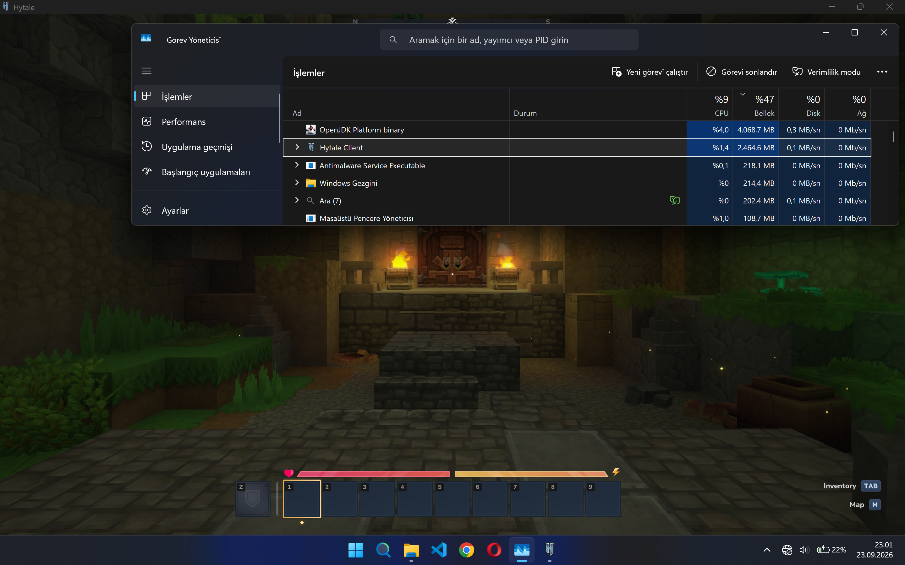
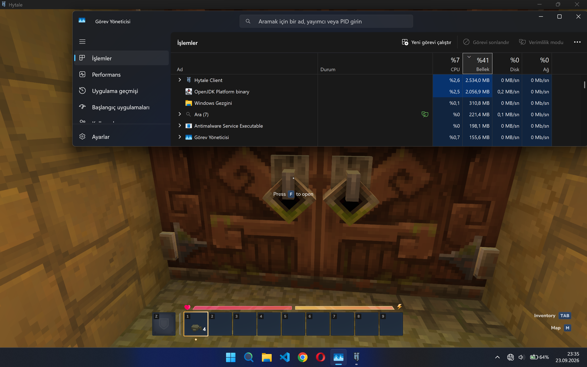

# Hytale Optimizer

<p align="center">
  
  
  
</p>

<p align="center">
  Hytale için yerel <strong>Assets.zip</strong> optimizasyon aracı<br />
  Local <strong>Assets.zip</strong> optimization tool for Hytale
</p>

<p align="center">
  <a href="#english">English</a> •
  <a href="#türkçe">Türkçe</a>
</p>

---

<a id="english"></a>

## 🇬🇧 English

**Hytale Optimizer** is a Python utility that safely processes Hytale's `Assets.zip` and can reduce unnecessary asset data. It creates a `.bak` backup, validates the archive, writes to a temporary archive, and replaces the original only after validation succeeds.

> ⚠️ **Experimental software:** Close Hytale and create your own additional backup before use. This project is not affiliated with Hytale or its rights holders and is intended only for local asset management, accessibility, and performance experimentation.

### What does it optimize?

The interactive program provides these options:

| Option | What it does |
| --- | --- |
| **Server JSON Minify** | Removes unnecessary whitespace from JSON-like files under `Server/`. |
| **Mute Music** | Replaces `.ogg` files under `Common/Music/` with the bundled silent `Empty.ogg`. |
| **Uncompress PNGs ≤ 256×256** | Re-encodes small PNG files when Pillow is available. |
| **Client JSON Minify** | Minifies `.blockymodel` and `.blockyanim` files under `Common/`. |
| **Check ZIP** | Checks whether `Assets.zip` is a readable, healthy ZIP archive. |

The optimizer only keeps a change when it is appropriate. Invalid files are skipped and reported instead of being destroyed. A backup is created as `Assets.zip.bak` and the archive size, changed files, skipped files, and errors are shown at the end.

### Screenshots

The same screenshots are used in both language sections:

| Original / Before optimization | Optimized / After optimization |
| --- | --- |
|  |  |
| Original, unoptimized view | Optimized view |

> Results depend on the contents of your own `Assets.zip`, selected mode, Hytale version, and system. The screenshots are examples, not a guaranteed benchmark.

### Requirements

- Python **3.10 or newer**
- A writable Hytale asset directory
- An `Assets.zip` file in the repository directory or one of its subdirectories
- A backup of the original archive
- **Pillow only for PNG optimization**; all other modes use Python's standard library

### Installation with `git clone`

`git clone` downloads a copy of this GitHub repository to your computer. `cd` then moves the terminal into that downloaded folder.

```bash
git clone https://github.com/Enjoyop2/Hytale-Optimizer.git
cd Hytale-Optimizer
python --version
```

On some systems, use `python3` instead of `python`:

```bash
python3 --version
```

### `pip` controls and Pillow installation

`pip` is Python's package manager. The optimizer does **not** need third-party packages for JSON, music, or ZIP checks. Install Pillow only if you want to use the PNG option.

Check that `pip` is available:

```bash
python -m pip --version
```

Install or update Pillow:

```bash
python -m pip install --upgrade Pillow
```

If your operating system requires it, use:

```bash
python3 -m pip install --upgrade Pillow
```

Verify Pillow:

```bash
python -c "from PIL import Image; print('Pillow OK:', Image.__version__)"
```

Using `python -m pip` is recommended because it installs the package into the same Python interpreter that runs the optimizer. A `requirements.txt` file is not currently necessary because Pillow is optional.

### Usage

1. Close Hytale.
2. Put `Assets.zip` in this repository or one of its subdirectories, or place the repository next to the Hytale installation.
3. Run the program:

```bash
python hytale_optimizer.py
```

4. Select an option from the menu.
5. Check the summary and keep `Assets.zip.bak` until you confirm that Hytale works correctly.

To check the archive without optimizing it, select **5) Check ZIP**. To exit, select **6) Exit**.

### Safety notes

- Do not run the optimizer while Hytale is using the archive.
- Keep an external backup in addition to the automatically created `.bak` file.
- Restore the backup if Hytale does not start or assets behave unexpectedly.
- Hytale updates may change archive paths or file formats; re-test after updates.
- This tool is not designed to bypass anti-cheat or provide an unfair online advantage.

### Repository files

| File | Purpose |
| --- | --- |
| [`hytale_optimizer.py`](hytale_optimizer.py) | Interactive optimizer and ZIP validation tool. |
| [`Empty.ogg`](Empty.ogg) | Silent audio file used by the music option. |
| [`screenshot/original_game.png`](screenshot/original_game.png) | Example before-optimization screenshot. |
| [`screenshot/optimize_game.png`](screenshot/optimize_game.png) | Example after-optimization screenshot. |

### Contributing

Issues and pull requests are welcome. Test changes against a copy of `Assets.zip`, explain platform-specific behavior, and include clear reproduction steps.

### License

No license has been declared yet. Until a license is added, all rights are reserved by the copyright holder.

---

<a id="türkçe"></a>

## 🇹🇷 Türkçe

**Hytale Optimizer**, Hytale'ın `Assets.zip` arşivini işleyen bir Python aracıdır. Gereksiz varlık verilerini azaltmaya yardımcı olur. İşlemden önce `.bak` yedeği oluşturur, arşivi kontrol eder, geçici bir arşive yazar ve yalnızca doğrulama başarılı olursa orijinal dosyanın yerine geçirir.

> ⚠️ **Deneysel yazılım:** Hytale'ı kapatın ve kullanmadan önce ayrıca kendi yedeğinizi alın. Bu proje Hytale veya hak sahipleriyle bağlantılı değildir; yalnızca yerel varlık yönetimi, erişilebilirlik ve performans denemeleri içindir.

### Neleri optimize eder?

Programdaki seçenekler:

| Seçenek | Ne işe yarar? |
| --- | --- |
| **Server JSON Minify** | `Server/` altındaki JSON benzeri dosyalardaki gereksiz boşlukları kaldırır. |
| **Mute Music** | `Common/Music/` altındaki `.ogg` dosyalarını repodaki sessiz `Empty.ogg` ile değiştirir. |
| **Uncompress PNGs ≤ 256×256** | Pillow kuruluysa küçük PNG dosyalarını yeniden kodlar. |
| **Client JSON Minify** | `Common/` altındaki `.blockymodel` ve `.blockyanim` dosyalarını küçültür. |
| **Check ZIP** | `Assets.zip` dosyasının okunabilir ve sağlam bir ZIP arşivi olup olmadığını kontrol eder. |

Optimizer yalnızca uygun değişiklikleri kaydeder. Geçersiz dosyalar silinmez; atlanır ve raporlanır. `Assets.zip.bak` adıyla yedek oluşturulur. İşlem sonunda arşiv boyutu, değişen dosyalar, atlanan dosyalar ve hatalar gösterilir.

### Görseller

Her iki dil bölümünde aynı görseller kullanılmaktadır:

| Optimize edilmemiş / Önce | Optimize edilmiş / Sonra |
| --- | --- |
|  |  |
| Optimize edilmemiş örnek görüntü | Optimize edilmiş örnek görüntü |

> Sonuç; kendi `Assets.zip` içeriğinize, seçtiğiniz moda, Hytale sürümüne ve sisteminize bağlıdır. Görseller örnektir; kesin bir benchmark sonucu garanti etmez.

### Gereksinimler

- Python **3.10 veya üzeri**
- Yazma izni olan Hytale varlık klasörü
- Repo klasöründe veya alt klasörlerinden birinde bulunan `Assets.zip`
- Orijinal arşivin yedeği
- **Yalnızca PNG optimizasyonu için Pillow**; diğer seçenekler Python'ın standart kütüphanesini kullanır

### `git clone` ile kurulum

`git clone`, bu GitHub reposunun bir kopyasını bilgisayarınıza indirir. `cd` komutu ise terminali indirilen klasöre geçirir.

```bash
git clone https://github.com/Enjoyop2/Hytale-Optimizer.git
cd Hytale-Optimizer
python --version
```

Bazı sistemlerde `python` yerine `python3` kullanmanız gerekebilir:

```bash
python3 --version
```

### `pip` kontrolleri ve Pillow kurulumu

`pip`, Python paket yöneticisidir. JSON, müzik ve ZIP kontrolleri için üçüncü taraf paket gerekmez. PNG seçeneğini kullanmak istiyorsanız yalnızca Pillow kurmanız yeterlidir.

`pip` kullanılabilir mi kontrol edin:

```bash
python -m pip --version
```

Pillow'u kurun veya güncelleyin:

```bash
python -m pip install --upgrade Pillow
```

İşletim sisteminiz gerektiriyorsa:

```bash
python3 -m pip install --upgrade Pillow
```

Pillow kurulumunu doğrulayın:

```bash
python -c "from PIL import Image; print('Pillow OK:', Image.__version__)"
```

`python -m pip` kullanılması önerilir; böylece paket, optimizer'ı çalıştıran aynı Python yorumlayıcısına kurulur. Pillow isteğe bağlı olduğu için şu anda `requirements.txt` gerekli değildir.

### Kullanım

1. Hytale'ı kapatın.
2. `Assets.zip` dosyasını bu repo klasörüne veya alt klasörlerinden birine koyun; alternatif olarak repo klasörünü Hytale kurulumu yanına yerleştirin.
3. Programı çalıştırın:

```bash
python hytale_optimizer.py
```

4. Menüden bir seçenek seçin.
5. Özeti kontrol edin ve Hytale'ın sorunsuz çalıştığından emin olana kadar `Assets.zip.bak` dosyasını saklayın.

Arşivi değiştirmeden kontrol etmek için **5) Check ZIP** seçeneğini kullanın. Çıkmak için **6) Exit** seçeneğini seçin.

### Güvenlik notları

- Hytale arşivi kullanırken optimizer'ı çalıştırmayın.
- Otomatik `.bak` dosyasına ek olarak harici bir yedek bulundurun.
- Hytale açılmazsa veya varlıklarda sorun olursa yedeği geri yükleyin.
- Hytale güncellemelerinden sonra arşiv yolları ve dosya biçimleri değişebileceği için tekrar test edin.
- Bu araç anti-cheat sistemlerini aşmak veya çevrim içi oyunda haksız avantaj sağlamak için tasarlanmamıştır.

### Repo dosyaları

| Dosya | Açıklama |
| --- | --- |
| [`hytale_optimizer.py`](hytale_optimizer.py) | Etkileşimli optimizer ve ZIP doğrulama aracı. |
| [`Empty.ogg`](Empty.ogg) | Müzik seçeneğinde kullanılan sessiz ses dosyası. |
| [`screenshot/original_game.png`](screenshot/original_game.png) | Optimizasyon öncesi örnek görsel. |
| [`screenshot/optimize_game.png`](screenshot/optimize_game.png) | Optimizasyon sonrası örnek görsel. |

### Katkıda bulunma

Issue ve pull request'ler memnuniyetle karşılanır. Değişiklikleri `Assets.zip` kopyası üzerinde test edin, platforma özel davranışları açıklayın ve net test adımları ekleyin.

### Lisans

Henüz bir lisans belirtilmemiştir. Lisans eklenene kadar tüm haklar telif sahibine aittir.

---

<p align="center">
  <sub>Built for careful local experimentation with Hytale assets • Hytale varlıklarıyla dikkatli yerel denemeler için hazırlanmıştır</sub>
</p>
